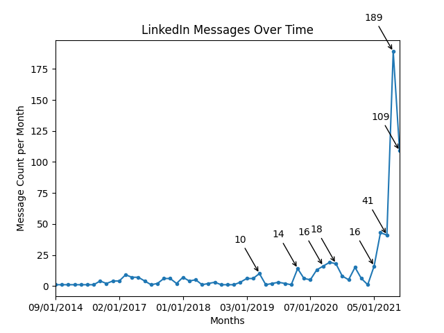
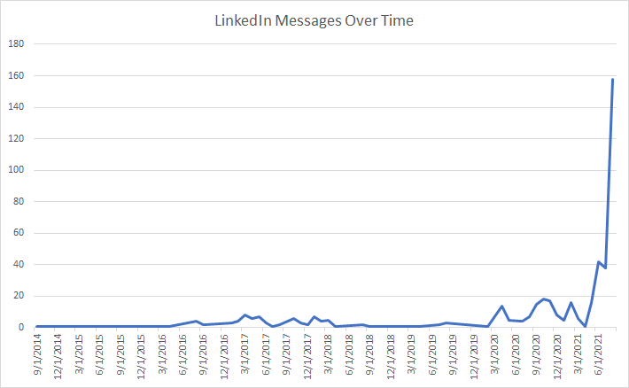
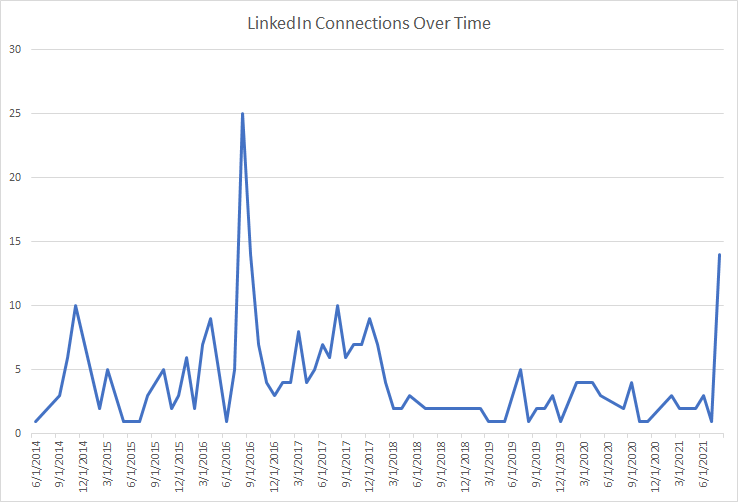
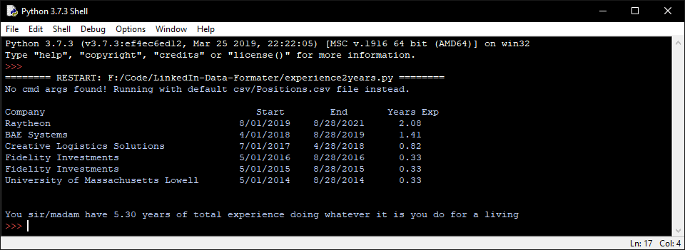

# LinkedIn-Data-Formater
Given a CSV file from LinkedIn's data export, this will be some code to format it into a nice readable report

## Usage:
Requires pandas be installed:

``pip install pandas``

``python messages2count.py <path to file to parse>``

## If using the graph stuff:
Also requires [matplotlib](https://matplotlib.org/) be installed:

``pip install matplotlib``

(note: providing a file path is optional - you can just drop the messages.csv file into the git repo and the messages2count.py script will choose it by default. this assumes you make a "csv" directory to drop them into.)

There are also a few other scripts you can try:

* connections2mine.py -> provide the "Connections.csv" file to get a count of connections over time

* experience2years.py -> provide the "Positions.csv" file to get a count of your years of experience

* jobapps2mine.py -> provide the "Job Applications.csv" file found under Jobs/ inside the full export to get a count of the job applications you sent on LinkedIn over time

Git clone the repo somewhere and drop in the "messages.csv" file you get from the LinkedIn Data Privacy page found [here](https://www.linkedin.com/psettings/member-data)

Run the script with Idle or another Python interpreter

View the console for some data, and also check out the auto generated "messages_analyzed.csv" file which should open with spreadsheet software such as Excel and Google Sheets

Here's an example graph that the script will generate too, assuming you have matplotlib installed:

Example of some graphs I generated with an Excel chart + the pandas generated csv file:

