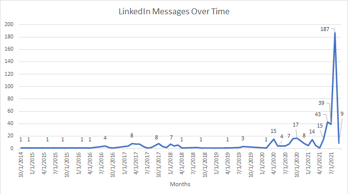

# LinkedIn-Data-Formater
Given a CSV file from LinkedIn's data export, this will be some code to format it into a nice readable report

## Usage:
Requires pandas be installed:

``pip install pandas``

``python export2filtered.py <path to file to parse>``

(note: providing a file path is optional - you can just drop the messages.csv file into the git repo and the export2filtered.py script will choose it by default)

Git clone the repo somewhere and drop in the "messages.csv" file you get from the LinkedIn Data Privacy page found [here](https://www.linkedin.com/psettings/member-data)

Run the script with Idle or another Python interpreter

View the console for some data, and also check out the auto generated "messages_analyzed.csv" file which should open with spreadsheet software such as Excel and Google Sheets

Example of some graphs I generated with an Excel chart + the pandas generated csv file:

